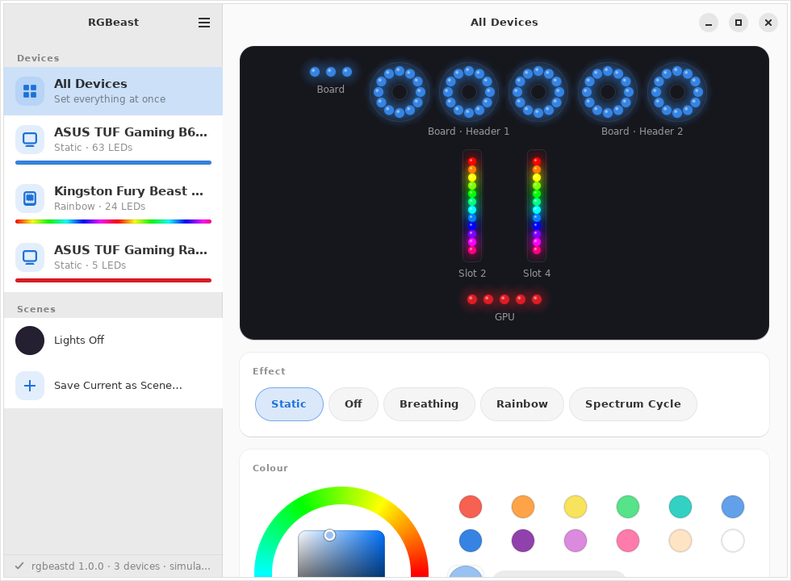
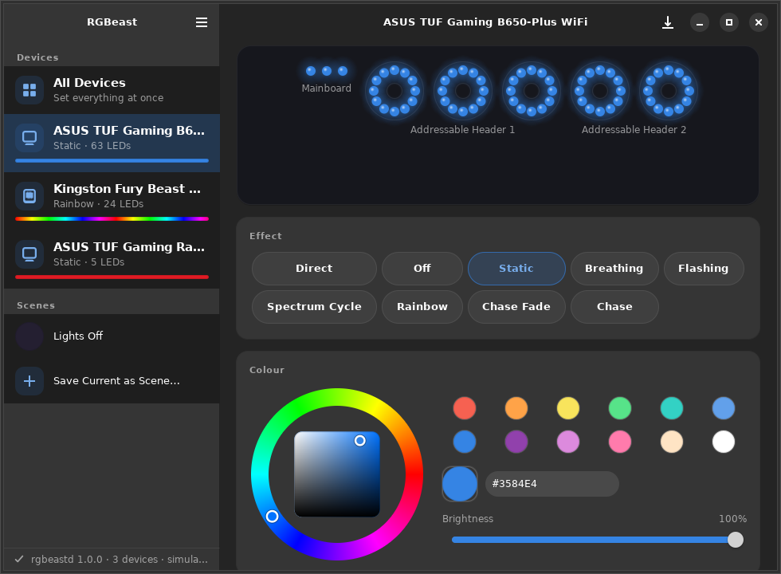
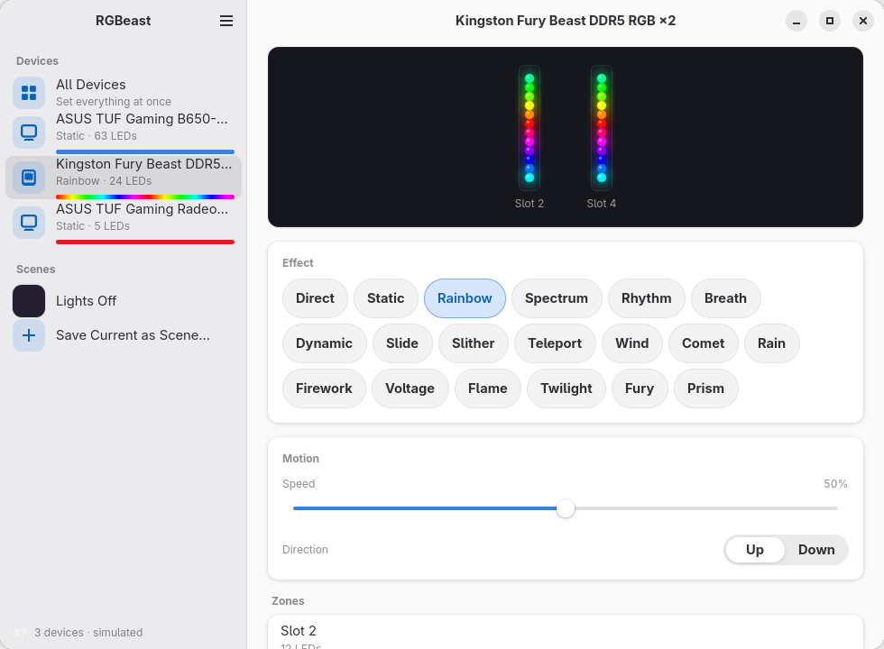
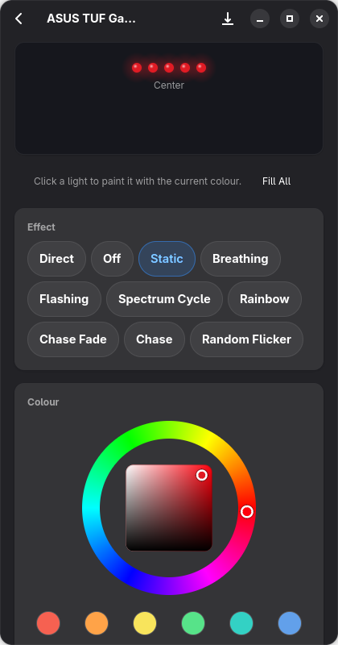

# RGBeast

**An RGB controller app I built for myself for Fedora Linux.**

Written from scratch in Rust with GTK 4 and libadwaita, designed to Apple's Human Interface
Guidelines (`docs/DESIGN.md`), delivered as an RPM.

RGBeast drives the lighting of an ASUS Aura motherboard (and the addressable fans plugged into its
headers), Kingston Fury DDR5 memory and ASUS graphics cards from one window that follows the GNOME
style and Apple's Human Interface Guidelines in spirit: navigation on the platform's sidebar
material, content on cards, neutral chrome, and the only saturated colour on screen is the light
you chose.



| Motherboard, dark style | Kingston Fury, light style | Narrow window |
|---|---|---|
|  |  |  |

## What it controls

| Hardware | How | Status |
|---|---|---|
| ASUS TUF / ROG / Prime boards with the Aura USB controller (`0b05:19af` and siblings): on-board LEDs, 12 V RGB headers, Addressable Gen 2 headers | USB HID, direct per-LED colour or 9 hardware effects, power-on default storable | implemented, unit-tested on recorded packets |
| Arctic P12 PWM PST A-RGB fans (and any WS2812 strip) on those headers | through the board; effects and colours reach them without setup, the LED count (12 per Arctic fan) is only needed for painting single lights and the preview | implemented |
| Kingston Fury Beast / Renegade DDR5 RGB (and DDR4) | chipset SMBus, 12 LEDs per stick, 19 hardware effects with speed, direction and up to 10 colours | implemented, unit-tested |
| ASUS TUF / ROG Strix / Astral graphics cards (ENE controller at `0x67`) | the card's own I2C bus (kernel 6.15+), direct per-LED colour or 9 hardware effects | implemented, unit-tested; not exercised on my machine, whose RX 9070 turned out to be a Sapphire card |
| Other ENE-based memory (G.Skill Trident Z, Geil) and older ASUS Aura SMBus boards | same ENE driver | detected, untested |

The **All Devices** page sets everything at once, choosing the closest effect each device has.
**Scenes** save the state of every device under a name; "Lights Off" is built in.

## How it is built

Three Rust crates, one Meson project, one RPM:

- `crates/rgbeast-core`: the protocols (`docs/PROTOCOLS.md`), a device model, and transports for hidraw
  and `/dev/i2c-*`. Every packet is covered by unit tests against a recording mock transport.
- `crates/rgbeastd`: a small system daemon. **It is the only process that opens device nodes.** It runs
  as the unprivileged user `rgbeast` under a strict systemd sandbox (no capabilities, no network,
  read-only system, seccomp, device allow-list), publishes `io.github.djshiye.RGBeast1` on the system
  bus, checks every change with polkit, and restores the last lighting at boot and after sleep.
- `crates/rgbeast`: the GTK 4 / libadwaita app. It never touches hardware.

Why a daemon: RGB control means raw writes on the same SMBus as the memory's SPD EEPROMs and on the
GPU's own I2C bus. Giving the desktop session direct access to `/dev/i2c-*` would let any process you
run write there. The daemon's D-Bus API only knows colours, modes, brightness, speed and direction.

## Install (Fedora)

Build the RPM (or download it from the CI artifacts) and install it:

```bash
sudo dnf install ./rgbeast-1.0.1-1.fc44.x86_64.rpm
```

The package creates the `rgbeast` system user, installs udev rules for the controllers, loads
`i2c-dev`, and enables `rgbeastd.service`. Launch **RGBeast** from the app grid. No reboot is needed; if
a device is missing, use **Scan for Devices** (Ctrl+R) and check `docs/TESTING.md`.

### First-run checklist

1. `systemctl status rgbeastd` is active.
2. `sudo -u rgbeast /usr/libexec/rgbeastd --scan` lists your devices with their locations.
3. The sidebar shows the motherboard, the memory and the graphics card.
4. Pick a colour: the fans follow. To paint single lights or see the fans in the preview, set the
   header's LED count in **Preferences › Addressable Headers** (12 per Arctic fan).

## Build from source

```bash
sudo dnf install rust cargo meson gtk4-devel libadwaita-devel systemd-devel \
     blueprint-compiler desktop-file-utils appstream gettext
meson setup builddir --prefix=/usr
meson compile -C builddir
sudo meson install -C builddir
```

`--prefix=/usr` matters: the system D-Bus only reads policies from `/usr/share/dbus-1/system.d`,
so an install under `/usr/local` leaves the daemon unable to own its bus name. The RPM runs the
steps below through Fedora's file triggers; after a plain `meson install` do them by hand once:

```bash
sudo systemd-sysusers                                   # creates the rgbeast user and group
sudo udevadm control --reload && sudo udevadm trigger -s hidraw -s i2c-dev
sudo modprobe i2c-dev
sudo busctl call org.freedesktop.DBus / org.freedesktop.DBus ReloadConfig
sudo systemctl daemon-reload && sudo systemctl enable --now rgbeastd
```

For development without installing: `cargo build`, then in one terminal
`./target/debug/rgbeastd --session --simulate` and in another `RGBEAST_BUS=session ./target/debug/rgbeast`.
The simulated devices are the target machine's: a TUF board with three addressable headers, two
Fury sticks and a TUF RX 9070.

### Build the RPM

```bash
cargo vendor vendor && tar -cJf rgbeast-1.0.1-vendor.tar.xz vendor
# source tarball named rgbeast-1.0.1.tar.gz with an rgbeast-1.0.1/ prefix
rpmdev-setuptree && cp rgbeast-1.0.1*.tar.* ~/rpmbuild/SOURCES/
rpmbuild -ba build-aux/rgbeast.spec
```

CI (`.github/workflows/ci.yml`) runs formatting, clippy, unit tests, a daemon smoke test on a
private session bus, the Meson validation tests and an RPM build on Fedora 44 and Rawhide.

## Design

The principles and how each one shows up in the app are in `docs/DESIGN.md`. In short: the sidebar
is the platform's navigation material and the editor's sections are libadwaita cards, every colour
is a `var(--…)` token so light, dark, high contrast, the system accent and user themes carry
through; pill chips for effects, a segmented control for direction, a colour wheel that is drawn
(not a stock dialog), a preview card that is the one dark surface even in light mode because lights
are read against dark, and effect animation in the preview only (30 fps cap, off with reduced
motion). Every control applies immediately and the header shows a quiet "Applied".

## Keyboard

`Ctrl+?` lists every shortcut in the app. `Ctrl+R` / `F5` scan for devices · `Ctrl+,` preferences ·
`Ctrl+W` close · `Ctrl+Q` quit · arrow keys on the colour wheel nudge hue (left/right) and
brightness (up/down), Shift for bigger steps.

## Files

- `/var/lib/rgbeast/state.json`: last state per device, header LED counts (daemon).
- `~/.config/rgbeast/scenes.json`: your scenes.
